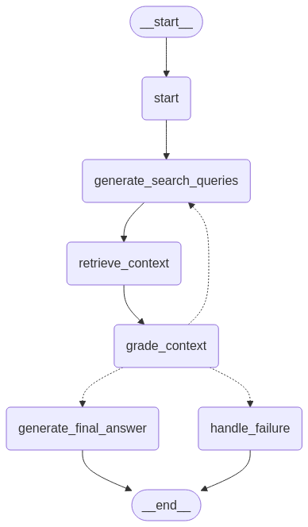

# Document Research Agent

An intelligent agent that can research and answer questions about your documents using LLMs and semantic search.

## Directory Structure

```
document_research/
├── src/                    # Main source code
│   ├── agent.py           # Main agent class
│   ├── graph_builder.py   # Graph construction logic
│   ├── graph_nodes/       # Node function implementations
│   ├── graph_state/       # State management
│   ├── llm_calls/         # LLM integration
│   └── retriever/         # Document retrieval
├── tests/                 # Test files
├── scripts/               # Utility scripts
│   ├── ingest_documents.py
│   ├── create_sample_docs.py
│   ├── generate_sample_report.py
│   └── update_evaluation.py
├── docs/                  # Documentation
│   ├── prd.md            # Product Requirements Document
│   ├── todo.md           # Development TODOs
│   └── EVALUATION_README.md
├── examples/             # Example code and usage
├── evaluation/          # Evaluation data and reports
│   ├── document_evaluation.py
│   ├── document_research_evaluation.xlsx
│   └── document_research_report_*.md
├── tools/               # Development tools
│   └── generate_graph_visualization.py
├── diagrams/           # Visual documentation
│   └── workflow_visualization.png
├── test_data/         # Test document files
├── chroma_db/         # Vector database storage
├── requirements.txt   # Python dependencies
├── setup.py          # Package configuration
├── pytest.ini        # Test configuration
├── .env.template     # Environment variable template
└── .gitignore       # Git ignore rules
```

## Installation

1. Clone the repository:
```bash
git clone https://github.com/yourusername/document_research.git
cd document_research
```

2. Create and activate a virtual environment:
```bash
python -m venv venv
source venv/bin/activate  # On Windows: venv\Scripts\activate
```

3. Install dependencies:
```bash
pip install -r requirements.txt
```

4. Copy `.env.template` to `.env` and fill in your API keys and configuration:
```bash
cp .env.template .env
```

## Usage

1. Ingest your documents:
```bash
python scripts/ingest_documents.py path/to/your/documents/*.pdf
```

2. Run a query:
```python
from src.agent import DocumentResearchAgent

agent = DocumentResearchAgent()
result = agent.run(
    query="What is the main topic of the documents?",
    filenames=["doc1.pdf", "doc2.pdf"]
)
print(result["final_answer"])
```

## Development

- Run tests: `python -m pytest`
- Generate documentation: `python tools/generate_graph_visualization.py`
- Create sample documents: `python scripts/create_sample_docs.py`
- Run evaluations: `python evaluation/document_evaluation.py`

## Contributing

1. Fork the repository
2. Create a feature branch
3. Make your changes
4. Run tests and linting
5. Submit a pull request

## License

This project is licensed under the MIT License - see the LICENSE file for details.

## Overview

The Document Research Agent helps users query and analyze collections of PDF documents using natural language. It provides functionality to:

1. Process PDF documents and extract their content
2. Create vector embeddings for semantic search
3. Query documents using natural language questions
4. Generate detailed responses based on the document content

## Workflow Visualization

The following diagram shows the LangGraph workflow of the Document Research Agent:



This workflow represents:
1. **Start**: Initialize the agent state
2. **Generate Search Queries**: Create semantic search queries based on the user's question
3. **Retrieve Context**: Search the document embeddings for relevant context
4. **Grade Context**: Evaluate if we have enough context to answer
   - If more context needed: Return to generate new queries
   - If sufficient context: Generate final answer
   - If no relevant context found: Handle failure
5. **Generate Final Answer/Handle Failure**: Produce the final response

The actual implementation can be found in `src/graph_builder.py`.

## Document Ingestion

Before using the Document Research Agent, you need to ingest documents into the ChromaDB vector database:

```bash
# Install required packages
pip install PyPDF2

# Run the ingestion script (default path is test_data/)
python ingest_documents.py

# Ingest documents from a specific directory
python ingest_documents.py --directory path/to/your/pdfs
```

The ingestion script:
- Extracts text from PDF files
- Splits documents into chunks
- Creates embeddings using OpenAI's embedding model
- Stores documents and embeddings in ChromaDB

## Architecture

- **ChromaDB**: Vector database for storing and retrieving document embeddings
- **LangChain**: Framework for building language model applications, with structured output support
- **LangGraph**: Flow control for conversational agents
- **OpenAI**: LLM API for natural language processing

## Features

- **Document Processing**: Automatically processes PDF documents and extracts text content
- **Semantic Search**: Retrieves the most relevant document sections based on natural language queries
- **Context-Aware Responses**: Generates responses that consider the document context
- **Command-Line Interface**: Simple CLI for interacting with the agent
- **Structured Output with LangChain**: Uses LangChain's structured output capabilities for reliable response formatting
- **Robust Error Handling**: Comprehensive error handling and detailed status reporting
- **Configurable Parameters**: Adjustable maximum iterations and other runtime parameters

## Usage

### Basic Query

```bash
python -m src.main "What are the key provisions in this contract?" --filenames path/to/document.pdf
```

### Using the Agent in Python Code

```python
from src.agent import DocumentResearchAgent

# Initialize the agent
agent = DocumentResearchAgent()

# Run a query
result = agent.run(
    query="What are the key provisions in this contract?",
    filenames=["path/to/document.pdf"],
    max_iterations=5,  # Optional: override default iterations
    include_scratchpad=True  # Optional: include agent reasoning
)

# Access the results
if result["success"]:
    print(f"Answer: {result['final_answer']}")
    
    for citation in result["citations"]:
        print(f"- {citation['filename']}, Page {citation['page']}: '{citation['text']}'")
    
    # Optional: access agent reasoning
    if "agent_scratchpad" in result:
        print(f"Agent reasoning: {result['agent_scratchpad']}")
else:
    print(f"Error: {result.get('error', 'Unknown error')}")
```

### Check Collection Status

```bash
# Check if documents are properly loaded into ChromaDB
python test_document_research.py --check-collection

# Check for specific files
python test_document_research.py --check-collection --filename document1.pdf --filename document2.pdf
```

### Run with Custom Query

```bash
# Run with a custom query
python test_document_research.py --query "What are the payment terms in this contract?"

# Run with specific files and verbose output
python test_document_research.py --query "Summarize the main points" --filename contract.pdf --verbose

# Run with custom max iterations
python test_document_research.py --max-iterations 3
```

## Evaluation Framework

The repository includes a comprehensive evaluation framework for testing and benchmarking the agent's performance. See [EVALUATION_README.md](EVALUATION_README.md) for details.

### Running Tests

```bash
# Run all tests
python -m pytest

# Run specific test file
python -m pytest tests/test_chroma_retriever.py
```

### Test Documents

The `test_data` directory contains sample legal documents for testing the agent. You can use these to evaluate performance with different document types.

### Evaluation Script

The `test_documents.py` script automates testing across different document types:

```bash
# Run all sample queries
./test_documents.py

# Run a specific query
./test_documents.py --query-index 2
``` 