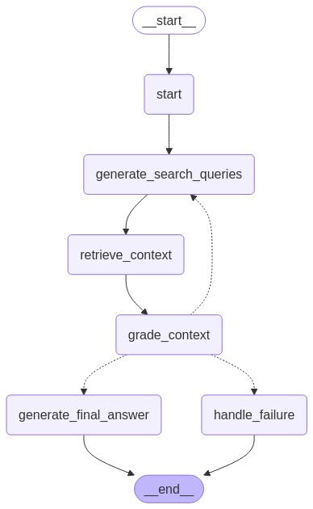

# Document Research Agent

A tool for natural language querying of PDF documents using ChromaDB vector embeddings and LangChain for conversational AI.

## Overview

The Document Research Agent helps users query and analyze collections of PDF documents using natural language. It provides functionality to:

1. Process PDF documents and extract their content
2. Create vector embeddings for semantic search
3. Query documents using natural language questions
4. Generate detailed responses based on the document content

## Workflow

The agent operates as a state machine orchestrated by LangGraph:



1. **Generate Search Queries**: LLM analyzes the original query and existing context to generate targeted search queries
2. **Retrieve Context**: Perform vector search with ChromaDB, filtering by specified document filenames
3. **Grade Context**: Evaluate if retrieved context is sufficient to answer the original query
4. **Generate Answer**: Synthesize answer using only retrieved context with accurate citations
5. **Format Output**: Structure the answer and citations into the final response

## Architecture

- **ChromaDB**: Vector database for storing and retrieving document embeddings
- **LangChain**: Framework for building language model applications
- **LangGraph**: Flow control for conversational agents
- **OpenAI**: LLM API for natural language processing

## Features

- **Document Processing**: Automatically processes PDF documents and extracts text content
- **Semantic Search**: Retrieves the most relevant document sections based on natural language queries
- **Context-Aware Responses**: Generates responses that consider the document context
- **Command-Line Interface**: Simple CLI for interacting with the agent

## Installation

1. Clone the repository:
```bash
git clone https://github.com/your-username/document_research_agent.git
cd document_research_agent
```

2. Create a virtual environment:
```bash
python -m venv venv
source venv/bin/activate  # On Windows: venv\Scripts\activate
```

3. Install dependencies:
```bash
pip install -r requirements.txt
```

4. Set up environment variables by copying the template and adding your API keys:
```bash
cp .env.template .env
# Edit .env file with your OpenAI API key and other settings
```

## Usage

### Basic Query

```bash
python -m src.main "What are the key provisions in this contract?" --filenames path/to/document.pdf
```

### Check Collection Status

```bash
python -m src.main "Check collection status" --filenames path/to/document.pdf --check-collection
```

### Run with Verbose Output

```bash
python -m src.main "What are the key provisions in this contract?" --filenames path/to/document.pdf --verbose
```

## Evaluation Framework

The repository includes a comprehensive evaluation framework for testing and benchmarking the agent's performance. See [EVALUATION_README.md](EVALUATION_README.md) for details.

### Running Tests

```bash
# Run all tests
python -m pytest

# Run specific test file
python -m pytest tests/test_chroma_retriever.py
```

### Test Documents

The `test_data` directory contains sample legal documents for testing the agent. You can use these to evaluate performance with different document types.

### Evaluation Script

The `test_documents.py` script automates testing across different document types:

```bash
# Run all sample queries
./test_documents.py

# Run a specific query
./test_documents.py --query-index 2
```

## License

MIT

## Contributing

Contributions are welcome! Please feel free to submit a Pull Request. 